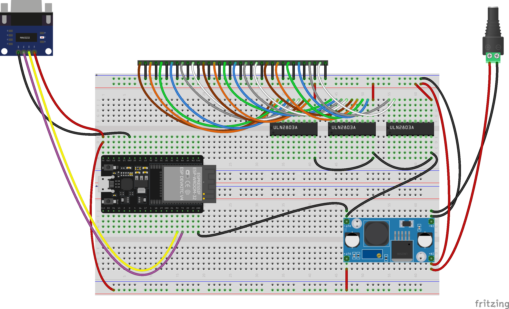

# G.U.I.T.A.R

G.U.I.T.A.R (Graphical Universal Interface for Tone and Audio Reproduction) is simple guitar playing "robot" based on ESP32-DevKitC board.

TODO image

## How it works

TODO How it works
TODO G.U.I.T.A.R App link

## ESP32-DevKitC Pinout

## Sketch

## Fritzing parts

- [ESP32-DevKitC V4 User Guide](https://docs.espressif.com/projects/esp-dev-kits/en/latest/esp32/esp32-devkitc/user_guide.html)
- [ESP32 DevKitc V4 ready](https://forum.fritzing.org/t/esp32-devkitc-v4-ready/17213/6)
- [RS232-to-TTL-Converter](https://github.com/foorschtbar/Fritzing-Parts)
